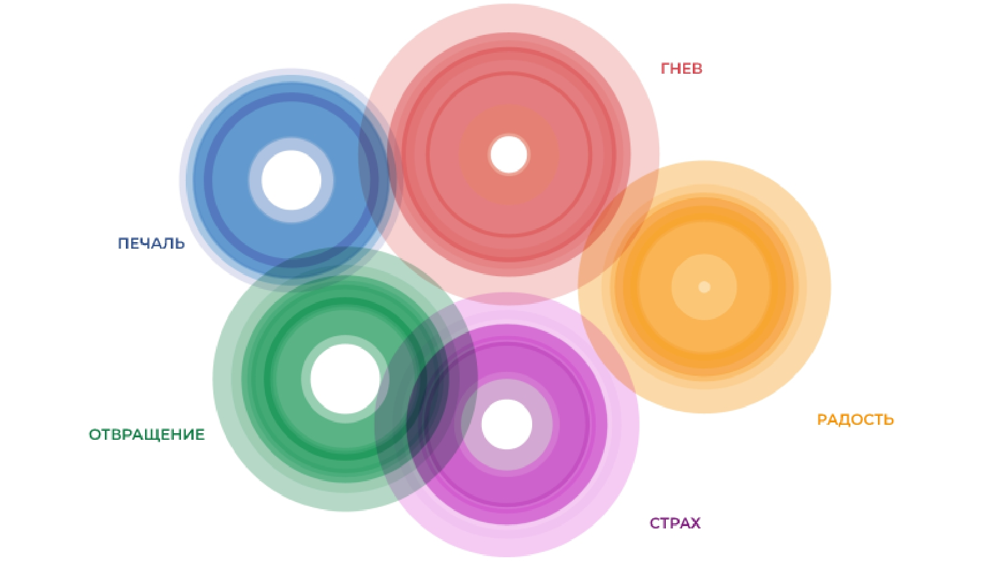
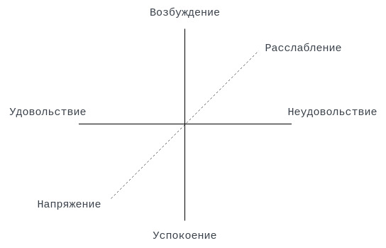
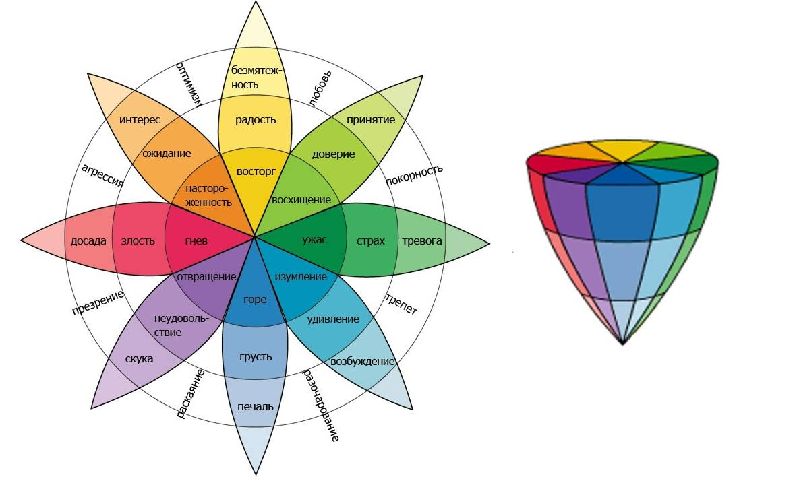
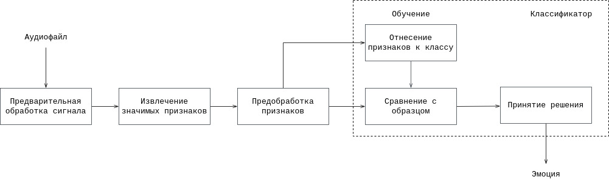
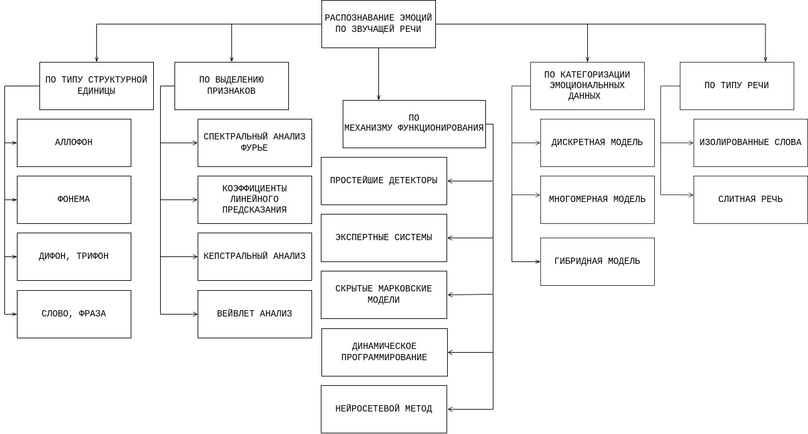

<!-- header: "Московский государственный технический университет
имени Н. Э. Баумана   (национальный исследовательский университет)" -->
Классификация задач распознавания эмоций из
звучащей речи и способов их решения
===

<!--  -->

## Студент: Казаева Татьяна Алексеевна ИУ7-76Б
## Научный руководитель: Строганов Юрий Владимирович

<!-- МГТУ им.  -->

<!-- footer: "Москва, 2022 г." -->

---

<!-- header: "Классификация задач распознавания эмоций из звучащей речи и способов их решения" -->
<!-- footer: "" -->
<!-- paginate: true -->

#### Цель и задачи

**Цель**: классификация способов решения задачи разпознавания эмоций из звучащей речи.
 
**Для достижения поставленной цели потребуется решить ряд задач:**

- сформировать классификацию эмоциональных состояний;

- описать информативные признаки, характеризующие речь;

- описать формальную постановку задачи;

- описать существующие решения задачи.

---

#### Задача распознавания эмоций из звучащей речи

Качественное улучшение при взаимодействии между субъектами в системах взаимодействия «человек-компьютер» и «человек-человек»
 
**«человек-компьютер»** - голосовые помощники, автоматизированные колл-центры, системы виртуальной реальности и.т.д

**«человек-человек»** - автоматизированный перевод, системы детектирования лжи, медицина, мониторинг настроения толпы и.т.д

---

#### Классификация эмоций (1/3)

**Дискретный подход**: выделение базовых эмоций (от 2 до 10), сочетания которых порождают разнообразие эмоциональных явлений.

Базовый набор эмоций определяется **эмпирически**.

---

#### Классификация эмоций (2/3)

**Многомерная модель**: эмоции в координатном многомерном пространстве.

Такие измерения охватывают все разнообразие эмоциональных состояний.

---

#### Классификация эмоций (3/3)

**Гибридная модель**: комбинация дискретной и многомерной модели.

В отдельной области *n-мерного* пространства различия между эмоциями могут определяться в терминах измерений, имеющих отношение к этой области.

---

#### Информативные признаки, характеризующие речь

Условно характеристики речи можно разбить на два основных класса – акустические и лингвистические.

**Акустические признаки можно разделить на пять категорий**:
- *просодические*: частота основного тона, темп речи;
- *динамические*: фонетическая функция;
- *фонационные*: отношение гармоник основного тона к шуму;
- *спектральные*: линейные спектральные частоты, мел-шкалы частот;
- *энергетические*: отношение мощностей в спектральных полосах, оценка
мощности сигнала.

---

#### Просодические характеристики

Совокупность темпорального, артикуляционного и интонационного компонентов речи.

| параметры | высокое значение       | низкое значение    |
| :-------: | :--------------------: | :----------------: |
| изменчивость частоты основного тона | радость, гнев, страх | печаль, безразличие                   |
| уровень частоты основного тона      | радость, гнев, страх, чувство приподнятости и уверенности в себе                                    | печаль, презрение, скука, безразличие |
| интенсивность                       | радость, гнев, презрение, чувство приподнятости, уверенности в себе | печаль, презрение, скука, безразличие |
| темп                                | радость, гнев, страх, чувство приподнятости, уверенности в себе, безразличия                        | печаль, презрение, скука              |

---

#### Спектральные характеристики

Основана на преобразовании Фурье. В частности, **мел-частотный анализ**.
 
*Перевод частоты из герц в мел*:
$$
    Mel(f) = 2595 \cdot \log_{10} \left( 1 + \cfrac{f}{700} \right),
$$
где $f$ – частота (Гц), $Mel$ – частота (мел)
 
Представляет частоты речи с позиции *высоты тона* - насколько высоким или низким кажется тон слушателю.

---
#### Динамические характеристики

**Звонкость (основной тон)** - величина, выражающая насколько периоическим является речевой сигнал в момент времени $t$. Для измерения используют автокорелляционную функцию.

 

**Сонорность** - степень участия шумовых составляющих. Для измерения используют использовать производную спектра в частотной области:

$$
    S^{(i)}_t = \log\left( \sum^{N / 2}_{n = 0}\left|a^{(i)}_t[n]\right|\right),
$$

где $a^{(i)}_t[n]$ - производная спектра $i$-го порядка нормализованного спектра $\hat{X}_t[n]$. 

---

#### Система распознавания речевых эмоций
Система соотносит **исходные данные - речевой сигнал**, к **виду эмоции - выходные данные**.
<!--  
  -->
 

**Классификация** – заключительный этап работы системы распознавания эмоций. 

Точность классификации в значительной мере зависит от выбранного классификатора.

---

#### Классификация систем извлечения эмоций

---

#### Заключение

**Цель работы достигнута**: способы решения задачи разпознавания эмоций из звучащей речи классифицированы.

- сформирована классификация эмоциональных состояний;

- описаны информативные признаки, характеризующие речь;

- описана формальная постановка задачи;

- описаны существующие решения задачи.

Предложена классификация систем распознавания эмоционального состояния на основе индивидуальных характеристик речи.