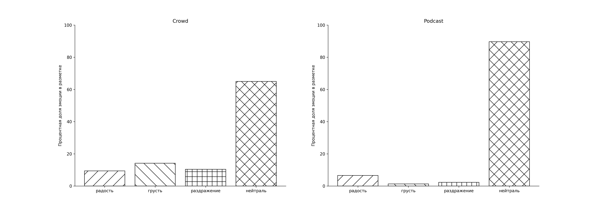
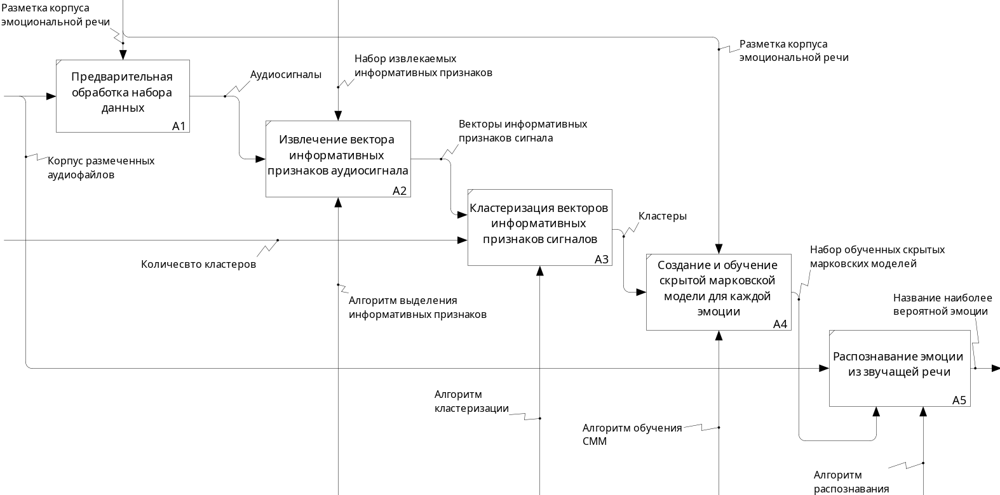
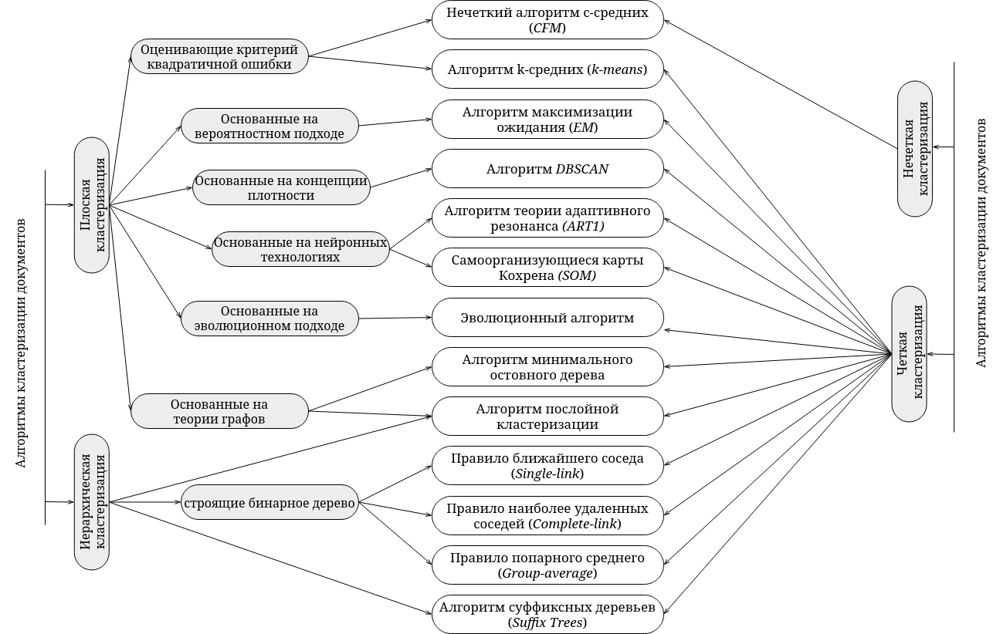
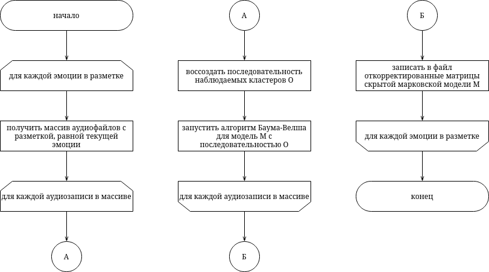
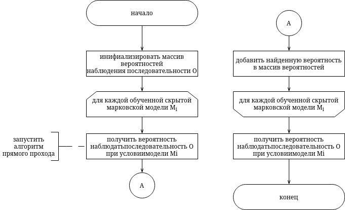
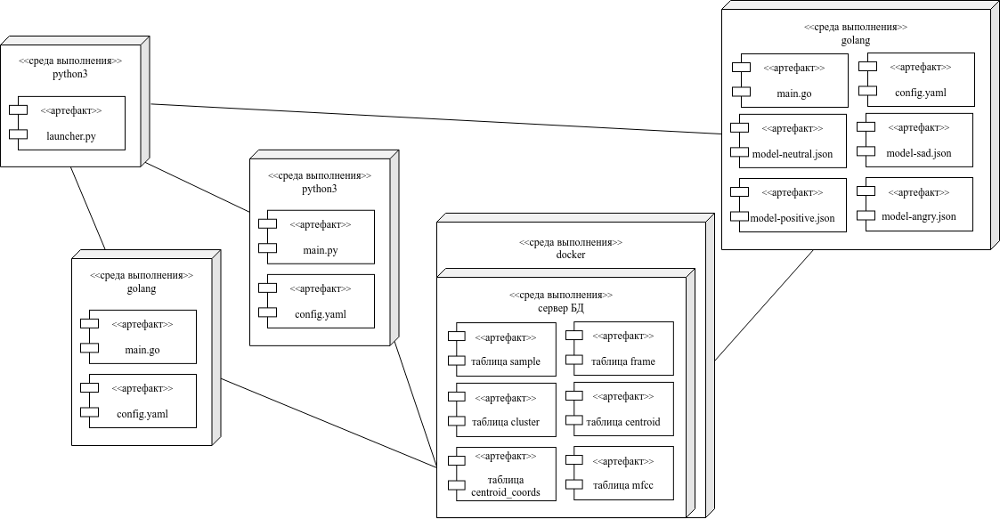

<!-- header: "Московский государственный технический университет
имени Н. Э. Баумана   (национальный исследовательский университет)" -->

## Выпускная квалификационная работа бакалавра

 

# «Mетод распознавания эмоций по звучащей речи на основе скрытой марковской модели»

 

### _Студент: Казаева Татьяна Алексеевна ИУ7-86Б_

### _Научный руководитель: Строганов Юрий Владимирович_

<!-- МГТУ им.  -->

---

<!-- header: "" -->
<!-- footer: "" -->

## <!-- paginate: true -->

## Цель и задачи работы

**Цель** - разработать метод определения эмоций по звучащей речи на основе скрытой марковской модели

**Задачи**:

- проанализировать существующие эмоциональные корпуса и выбрать наиболее подходящий для обучения классификатора
- проанализировать информативные признаки, характеризующие эмоциональную речь
- проанализировать классификатороы, чаще всего используемые в анализе речевых эмоций
- спроектировать и реализовать метод детектирования эмоций
- рассчитать качественные характеристики классификатора

---

## Определение эмоций

<table class = "widetab">
    <tr>
        <th>Подход</th>
        <th>Основа подхода</th>
        <th>Категроии</th>
        <th>Примеры решений</th>
    </tr>
    <tr>
        <td>Дискретный</td>
        <td>Выделение базовых эмоций</td>
        <td>Некоторый набор дискретных эмоций</td>
        <td>Affectiva, RAVDESS, SAVEE, EmoDB...</td>
    </tr>
    <tr>
        <td>Многомерный</td>
        <td>Координатное многомерное пространство</td>
        <td>Валентность, активация, интенсивность</td>
        <td>RECOLA, колесо эмоций Плутчика</td>
    </tr>
    <tr>
        <td>Гибридный</td>
        <td>Комбинация дискретного и многомерного подходов</td>
        <td>Базовые эмоции и уровни силы эмоций</td>
        <td>"Песочные часы эмоций"</td>
    </tr>
</table>

---

## Корпуса звучащей речи

<table class="widetab">
  <tr>
    <th rowspan="2" class = "smaller-cell" >Название</th>
    <th rowspan="2" class = "smaller-cell" >Количество эмоций</th>
    <th colspan="2" class = "smaller-cell" >Количество голосов</th>
    <th rowspan="2" class = "smaller-cell" >Лексикон</th>
    <th rowspan="2" class = "smaller-cell" >Публичный</th>
    <th rowspan="2" class = "smaller-cell" >Поддержка русского языка</th>
  </tr>
  <tr>
    <th  class = "smaller-cell" >М</th>
    <th  class = "smaller-cell" >Ж</th>
  </tr>
  <tr>
    <td class = "smaller-cell" >RAVDESS</td>
    <td class = "smaller-cell" >7</td>
    <td class = "smaller-cell" >12</td>
    <td class = "smaller-cell" >12</td>
    <td class = "smaller-cell" >2 предл.</td>
    <td class = "smaller-cell" >да</td>
    <td class = "smaller-cell">нет</td>
  </tr>
  <tr>
    <td class = "smaller-cell" >SAVEE</td>
    <td class = "smaller-cell" >6</td>
    <td class = "smaller-cell" >4</td>
    <td class = "smaller-cell" >0</td>
    <td class = "smaller-cell" >15 предл.</td>
    <td class = "smaller-cell" >да</td>
    <td class = "smaller-cell">нет</td>
  </tr>
  <tr>
    <td class = "smaller-cell">Emo-DB</td>
    <td class = "smaller-cell">6</td>
    <td class = "smaller-cell">5</td>
    <td class = "smaller-cell">5</td>
    <td class = "smaller-cell">10 предл.</td>
    <td class = "smaller-cell">да</td>
    <td class = "smaller-cell">нет</td>
  </tr>
  <tr>
    <td class = "smaller-cell">TESS</td>
    <td class = "smaller-cell">7</td>
    <td class = "smaller-cell">0</td>
    <td class = "smaller-cell">2</td>
    <td class = "smaller-cell">200 слов</td>
    <td class = "smaller-cell">да</td>
    <td class = "smaller-cell">нет</td>
  </tr>
  <tr>
    <td class = "smaller-cell">RUSLANA</td>
    <td class = "smaller-cell">4</td>
    <td class = "smaller-cell">12</td>
    <td class = "smaller-cell">49</td>
    <td class = "smaller-cell">10 предл.</td>
    <td class = "smaller-cell">нет</td>
    <td class = "smaller-cell">да</td>
  </tr>
  <tr>
    <td class = "bold-cell">DUSHA</td>
    <td class = "bold-cell">4</td>
    <td class = "bold-cell">-</td>
    <td class = "bold-cell">-</td>
    <td class = "bold-cell">обширный</td>
    <td class = "bold-cell">да</td>
    <td class = "bold-cell">да</td>
  </tr>
  <tr>
    <td class = "smaller-cell">REC</td>
    <td class = "smaller-cell">-</td>
    <td class = "smaller-cell">-</td>
    <td class = "smaller-cell">-</td>
    <td class = "smaller-cell">обширный</td>
    <td class = "smaller-cell">нет</td>
    <td class = "smaller-cell">да</td>
  </tr>
</table>

---

## Распределение классов разметки корпуса DUSHA

---

## Предлагаемый метод

---

### Обучающий набор данных, составленный из корпуса DUSHA

 

  В обучающий набор было включено 1500 аудиофайлов каждого класса разметки.

 

| _Подгруппа_ |       _Всего_        | _Тренировочная выборка_ | _Тестовая выборка_ |
| :---------: | :------------------: | :---------------------: | :----------------: |
| раздражение | 1 ч. 02 мин. 47 сек. |     50 мин. 05 сек.     |  12 мин. 41 сек.   |
|  нейтраль   | 1 ч. 02 мин. 23 сек. |     50 мин. 02 сек.     |  12 мин. 20 сек.   |
|   радость   | 1 ч. 02 мин. 01 сек. |     50 мин. 32 сек.     |  12 мин. 29 сек.   |
|   грусть    | 1 ч. 02 мин. 53 сек. |     51 мин. 57 сек.     |  12 мин. 55 сек.   |

  Шумоочистка к аудиофайлам не применялась.

---

## Просодические признаки речи

Признаки оцениваются в баллах: 1 - низший балл, 3 - высший балл.

 

<table class="widetab">
    <tr>
    <th></th>
    <th>Устойчивость к шуму</th>
    <th>Информативность</th>
    <th>Емкость представления</th>
  </tr>
  <tr>
    <th >Частота основного тона</th>
    <td >3</td>
    <td >1</td>
    <td >1</td>
  </tr>
  <tr>
    <th>Интенсивность</th>
    <td>3</td>
    <td>2</td>
    <td>3</td>
  </tr>
  <tr>
    <th >Темп речи</th>
    <td >3</td>
    <td >3</td>
    <td >3</td>
  </tr>
  <tr>
    <th>Паузация</th>
    <td>1</td>
    <td>1</td>
    <td>3</td>
  </tr>
</table>

---

## Спектральные признаки речи

Признаки оцениваются в баллах: 1 - низший балл, 3 - высший балл.

 

<table class="widetab">
  <tr>
    <th></th>
    <th>Устойчивость к шуму</th>
    <th>Информативность</th>
    <th>Емкость представления</th>
  </tr>
  <tr>
    <th class = "bold-cell">Мел-кепстральные коэффициенты</th>
    <td class = "bold-cell">2</td>
    <td class = "bold-cell">3</td>
    <td class = "bold-cell">3</td>
  </tr>
  <tr>
    <th>Частоты первых четырех формант</th>
    <td>2</td>
    <td>3</td>
    <td>2</td>
  </tr>
  <tr>
    <th>Джиттер, шиммер</th>
    <td>1</td>
    <td>1</td>
    <td>1</td>
  </tr>
</table>

---

## Мел-кепстральные коэффициенты

 

Мел-кепстральный коэффициент под номером $n$ вычисляется согласно:

 

$$
    c_j(n) = \sum_{m=0}^{M-1}T_j(m)\cos\left(
      \pi n\left(m + \cfrac{1}{2}\right) \big/ M
    \right),\;0 \leq n < M,
$$

 

где $M$ - размерность банка мел-фильтров из треугольных фильтров, $T_j(m)$ - логарифмическое значение энергии компонент спектра на выходе мел-фильтра $m$, $j$ - номер кадра аудиозаписи.

<!-- где $T_j(m)$ - логарифмическое значение энергии компонент спектра на выходе каждого треугольного мел-фильтра. -->

---

## Классификация алгоритмов кластеризации

---

## Классификаторы, наиболее часто используемые в аффективных вычислениях

 

  

**Скрытая марковская модель (СММ)**

- используется для моделирования _последовательностей данных_
- данные преобразуются в последовательность наблюдений

  

  

**Искусственная нейронная сеть (ИНС)**

- состоят из соединенных и взаимодействующих искусственных нейронов
- данные передаются через слои искусственных нейронов

    

  

---

## Скрытая марковская модель

 

Можно описать как _двойной стохастический процесс_:

 

**проявление эмоции** -
скрытый стохастический процесс, который невозможно наблюдать напрямую

**наблюдаемый набор мел-кепстральных коэффициентов** -
процесс, который создает последовательность наблюдений

---

## Обучение скрытой марковской модели

---

## Распознавание эмоций в речи

---

## Диаграмма развертывания

---

## Результат классификации на тренировочной выборке

Матрица неточностей для классификации на тренировочной выборке.
 

<table>
    <tr>
        <th rowspan="2">экспертная оценка</th>
        <th colspan="4">оценка классификатора</th>
    </tr>
    <tr>
        <th>злость</th>
        <th>нейтраль</th>
        <th>Полож.</th>
        <th>грусть</th>
    </tr>
    <tr>
        <th>злость</th>
        <td class="colored-cell">44.3%</td>
        <td>6.2%</td>
        <td>35.9%</td>
        <td>13.6%</td>
    </tr>
    <tr>
        <th>нейтраль</th>
        <td>17.7%</td>
        <td class="colored-cell">11.8%</td>
        <td>44.8%</td>
        <td>25.8%</td>
    </tr>
    <tr>
        <th>Полож.</th>
        <td>30.8%</td>
        <td>5.8%</td>
        <td class="colored-cell">50.3%</td>
        <td>13.1%</td>
    </tr>
    <tr>
        <th>грусть</th>
        <td>28.0%</td>
        <td>7.3%</td>
        <td>34.6%</td>
        <td class="colored-cell">30.1%</td>
    </tr>
</table>

---

## Оценка результата классификации (1/2)

 "нейтраль" 

<table class="sudoku">
  <tr>
    <td style="border-left: 0; border-right: 0;border-top: 0; border-bottom: 0">  </td>
    <td style="border-left: 0; border-right: 0;border-top: 0; border-bottom: 0"> Полож. </td>
    <td style="border-left: 0; border-right: 0;border-top: 0; border-bottom: 0"> Отриц. </td>
  </tr>
  <tr>
    <td style="border-left: 0;border-top: 0; border-bottom: 0"> Полож. </td>
    <td class="colored-cell">141</td>
    <td class="sudoku-square">780</td>
  </tr>
  <tr>
    <td style="border-left: 0;border-top: 0; border-bottom: 0"> Отриц. </td>
    <td class="sudoku-square">1059</td>
    <td class="colored-cell">4373</td>
  </tr>
</table>

$\mathrm{Precision_{нейтраль}} = 0.38\%$
$\mathrm{Recall_{нейтраль}} = 11\%$
$\mathrm{F_{нейтраль}} = 28\%$

 "грусть" 

<table class="sudoku">
  <tr>
    <td style="border-left: 0; border-right: 0;border-top: 0; border-bottom: 0">  </td>
    <td style="border-left: 0; border-right: 0;border-top: 0; border-bottom: 0"> Полож. </td>
    <td style="border-left: 0; border-right: 0;border-top: 0; border-bottom: 0"> Отриц. </td>
  <tr>
    <td style="border-left: 0;border-top: 0; border-bottom: 0"> Полож. </td>
    <td class="colored-cell">361</td>
    <td class="sudoku-square">4491</td>
  </tr>
  <tr>
    <td style="border-left: 0;border-top: 0; border-bottom: 0"> Отриц. </td>
    <td class="sudoku-square">462</td>
    <td class="colored-cell">799</td>
  </tr>
  </tr>

</table>

$\mathrm{Precision_{грусть}} = 36\%$
$\mathrm{Recall_{грусть}} = 30\%$
$\mathrm{F_{грусть}} = 32%$

---

## Оценка результата классификации (2/2)

 "злость" 

<table class="sudoku">
  <tr>
    <td style="border-left: 0; border-right: 0;border-top: 0; border-bottom: 0">  </td>
    <td style="border-left: 0; border-right: 0;border-top: 0; border-bottom: 0"> Полож. </td>
    <td style="border-left: 0; border-right: 0;border-top: 0; border-bottom: 0"> Отриц. </td>
  </tr>
  <tr>
    <td style="border-left: 0;border-top: 0; border-bottom: 0"> Полож. </td>
    <td class="colored-cell">533</td>
    <td class="sudoku-square">920</td>
  </tr>
  <tr>
    <td style="border-left: 0;border-top: 0; border-bottom: 0"> Отриц. </td>
    <td class="sudoku-square">467</td>
    <td class="colored-cell">4095</td>
  </tr>
</table>

$\mathrm{Precision_{злость}} = 37\%$
$\mathrm{Recall_{злость}} = 44\%$
$\mathrm{F_{злость}} = 36\%$

 "радость" 

<table class="sudoku">
  <tr>
    <td style="border-left: 0; border-right: 0;border-top: 0; border-bottom: 0">  </td>
    <td style="border-left: 0; border-right: 0;border-top: 0; border-bottom: 0"> Полож. </td>
    <td style="border-left: 0; border-right: 0;border-top: 0; border-bottom: 0"> Отриц. </td>
  </tr>
    <tr>
    <td style="border-left: 0;border-top: 0; border-bottom: 0"> Полож. </td>
    <td class="colored-cell">603</td>
    <td class="sudoku-square">1206</td>
  </tr>
  <tr>
    <td style="border-left: 0;border-top: 0; border-bottom: 0"> Отриц. </td>
    <td class="sudoku-square">1007</td>
    <td class="colored-cell">4690</td>
  </tr>
</table>

$\mathrm{Precision_{радость}}=36\%$
$\mathrm{Recall_{радость}} = 50\%$
$\mathrm{F_{радость}} = 43\%$

---

## Выводы

 

На выборке из **6000 элементов** с развномерным распределением классов:

общая F-мера $\approx 35\%$
максимальная F-мера $\approx 43\%$

Класс, распознанный
**наиболее качественно** - "радость" (полнота распознавания $\approx 50\%$),
**наименее качественно** - "нейтраль" (полнота распознавания $\approx 11\%$)

---

## Заключение

**Цель работы достигнута**: был разработан и реализован метод распознавания эмоций по звучащей речи. Все поставленные задачи были выполнены:

- проанализированы русскоязычные и иностранные корпуса эмоциональной речи, для обучения классификатора был выбран корпус **DUSHA**
- проанализированы признаки, характеризующие эмоцию в речи, для классификации были использованы **мел-кепстральные коэффициенты**
- проведен обзор классификаторов, используемых в анализе речевых эмоций
- спроектирован и реализован метод детектирования эмоций
- с помощью качественных метрик (_F-мера, точность, полнота_) **оценен результат** классификации.

---

## Дальнейшее развитие

 

сбор собственного корпуса звучащей речи, содержащего аудиозаписи **студийного качества**, озвученные профессиональными актерами

расширение объема информации в разметке:
учет **интонационного контура** (ИК) для каждой аудиозаписи

