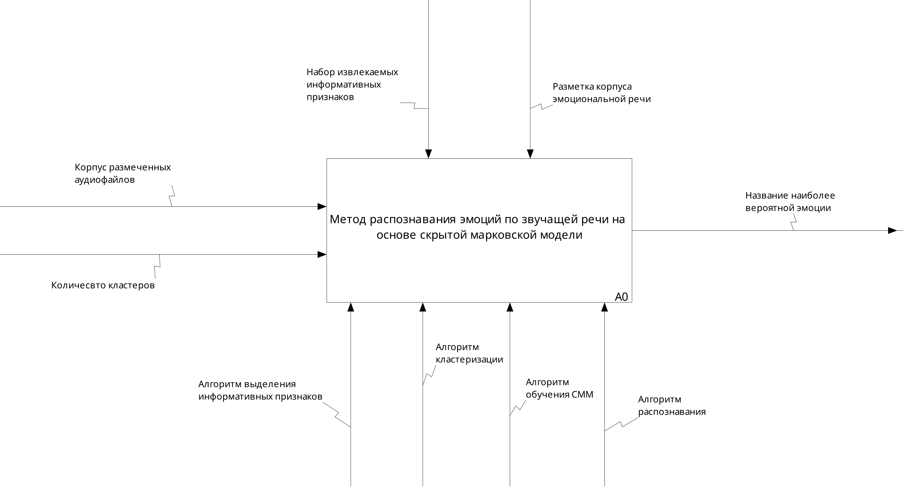
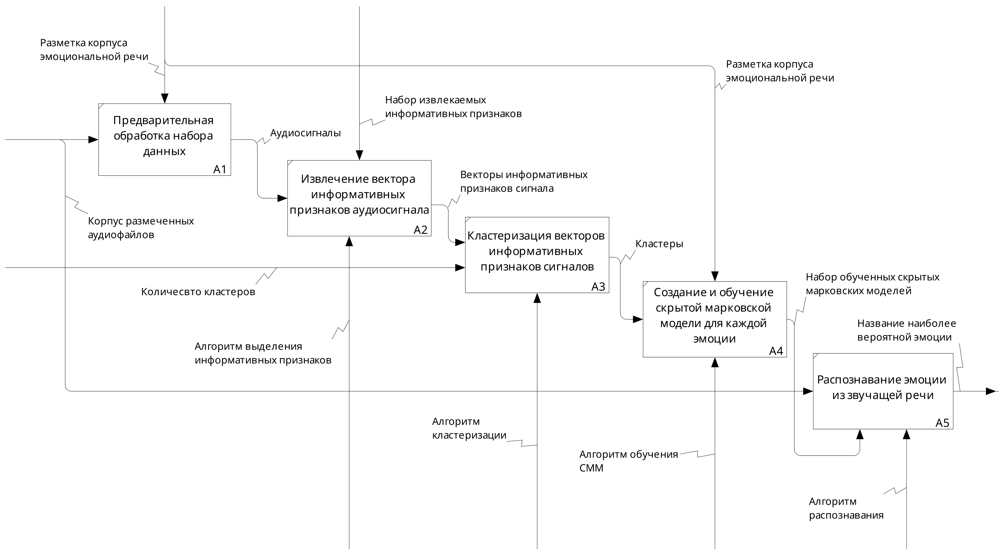

<!-- header: "Московский государственный технический университет
имени Н. Э. Баумана   (национальный исследовательский университет)" -->

## Выпускная квалификационная работа бакалавра

 

# «Mетод распознавания эмоций по звучащей речи на основе скрытой марковской модели»

 

### _Студент: Казаева Татьяна Алексеевна ИУ7-76Б_

### _Научный руководитель: Строганов Юрий Владимирович_

<!-- МГТУ им.  -->

## <!-- footer: "Москва, 2022 г." -->

## <!-- paginate: true -->

---

## Цель и задачи работы

**Цель** - разработать метод определения эмоций по звучащей речи на основе скрытой марковской модели

 

**Задачи**:

- провести анализ существующих эмоциональных корпусов и выбрать наи-
  более подходящий для обучения классификатора
- провести обзор информативных признаков, характеризующих речь и способов их выделения
- провести обзор классификаторов, используемых в анализе речевых эмоций
- спроектировать и реализовать метод детектирования эмоций
- определить качественные характеристики классификатора

---

## Области применения

  

**Здравоохранение**

диагностика и мониторинг психических состояний пациентов

**Маркетинг и реклама**

автоматическая оценка CSI (_англ. Customer Satisfaction Index_) в колл-центрах

**Безопасность**

анализ эмоциональных состояний, связанных с потенциальными угрозами безопасности

---

## Корпуса звучащей речи на русском языке

  

**RUSLANA**

первая открытая русскоязычная база данных эмоциональной речи, содержит около 3 660 аудио, создана в 2002 году
 

**нет в открытом доступе**

**DUSHA**

состоит из более 300 000 аудиозаписей, длительность составляет около 350 часов аудио, создан в 2022 году
 

**есть в октытом доступе**

---

## Корпус звучащей речи DUSHA

---

### Предварительная обработка обучающего набора данных

 

  В обучающую выборку было включено 1500 аудиофайлов каждого класса разметки.

 

| _Подгруппа_ |       _Всего_        | _Тренировочная выборка_ | _Тестовая выборка_ |
| :---------: | :------------------: | :---------------------: | :----------------: |
| раздражение | 1 ч. 02 мин. 47 сек. |     50 мин. 05 сек.     |  12 мин. 41 сек.   |
|  нейтраль   | 1 ч. 02 мин. 23 сек. |     50 мин. 02 сек.     |  12 мин. 20 сек.   |
|   радость   | 1 ч. 02 мин. 01 сек. |     50 мин. 32 сек.     |  12 мин. 29 сек.   |
|   грусть    | 1 ч. 02 мин. 53 сек. |     51 мин. 57 сек.     |  12 мин. 55 сек.   |

---

## Мел-кепстральные коэффициенты (1/2)

 

- **перцептивно-ориентированные**
  учет акустических особенности человеческого слуха (более высокая чувствительность к низким частотам и менее чувствительность к высоким частотам)

- **репрезентативные**
  для анализа речи используется только небольшое подмножество 12-15 коэффициентов MFCC, начиная с первого коэффициента

- **устойчивы к шуму**
  позволяют извлекать релевантную информацию о речи, минимизируя влияние шума и других помех.

---

## Мел-кепстральные коэффициенты (2/2)

Мел-кепстральный коэффициент под номером $m$
вычисляется согласно 1:

 

$$
    c_j(m) = \sum_{m=0}^{M-1}T_j(m)\cos\left(\cfrac{\pi n\left(m + \cfrac{1}{2}\right)}{M}\right),\;0 \leq n < M,
$$

 

где $T_j(m)$ - логарифмическое значение энергии компонент спектра на выходе каждого треугольного мел-фильтра фильтра.

---

## Классификаторы

 

  

**Скрытая марковская модель (СММ)**

- используется для моделирования _последовательностей данных_
- данные преобразуются в последовательность наблюдений

  

  

**Искусственная нейронная сеть (ИНС)**

- имитирует работу _человеческого мозга_
- данные передаются через слои искусственных нейронов

    

  

NB: сказать что наиболее подходящее решение для данной задачи потому что распознавание эмоций в речи обычно требует анализа последовательности звуков во времени

---

## Скрытая марковская модель (1/2)

 

Можно описать как _двойной стохастический процесс_:

 

**проявление эмоции** -
скрытый стохастический процесс, который невозможно наблюдать напрямую

**наблюдаемый интонационный рисунок** -
процесс, который создает последовательность наблюдений с учетом первого процесса

---

## Скрытая марковская модель (2/2)

 

**Обучение**

определение параметров $\lambda = \{A, B, \pi\}$ с учетом количества последовательностей наблюдений $\{O = O_1, \dots, O_n\}$
 

**Алгоритм Баума-Велша**

**Распознавание**

вычисление вероятности наблюдать представленную на вход последовательность при условии заданной модели

 

**Алгоритм прямого хода**

 

---

## Кластеризация

В качестве элементов наблюдаемой последовательности используются **кластеры**, к которым принадлежат соответствующие векторы мел-кепстральных коэффициентов.

 

Кластеры сформированы алгоритмом **k-means**, в качестве меры расстояния - Евклидово расстояние:

$$
    \mathrm{dist}(p,\;q) = \sqrt{(p - q)^2},
$$

где $p, q$ - точки векторов мел-кепстральных коэффициентов.

---

## Проектируемый метод (1/2)

---

## Проектируемый метод (2/2)

---

## Оценка результата классификации (1/4)

Результат распознавания на тренировочной выборке представлен в виде матрицы общиок:
 

<table>
    <tr>
        <th rowspan = "2">экспертная оценка </th>
        <th colspan="4">оценка классификатора</th>
    </tr>
    <tr>
        <th>angry</th>
        <th>neutral</th>
        <th>positive</th>
        <th>sad</th>
    </tr>
    <tr>
        <th>angry</th>
        <td class="colored-cell" >0.443</td>
        <td>0.062</td>
        <td>0.359</td>
        <td>0.136</td>
    </tr>
    <tr>
        <th>neutral</th>
        <td>0.177</td>
        <td class="colored-cell" >0.118</td>
        <td>0.448</td>
        <td>0.258</td>
    </tr>
    <tr>
        <th>positive</th>
        <td>0.308</td>
        <td>0.058</td>
        <td class="colored-cell" >0.503</td>
        <td>0.131</td>
    </tr>
    <tr>
        <th>sad</th>
        <td>0.28</td>
        <td>0.073</td>
        <td>0.346</td>
        <td class="colored-cell" >0.301</td>
    </tr>
</table>

---

## Оценка результата классификации (2/4)

<table>
  <thead>
    <tr>
      <th rowspan="3">класс</th>
      <th colspan="4">метки</th>
    </tr>
    <tr>
      <th>true positive</th>
      <th>false positive</th>
      <th>true negative</th>
      <th>false negative</th>
    </tr>
  </thead>
  <tbody>
    <tr>
      <td>angry</td>
      <td>533</td>
      <td>920</td>
      <td>4095</td>
      <td>467</td>
    </tr>
    <tr>
      <td>neutral</td>
      <td>141</td>
      <td>780</td>
      <td>4373</td>
      <td>1059</td>
    </tr>
    <tr>
      <td>positive</td>
      <td>603</td>
      <td>1206</td>
      <td>4690</td>
      <td>1007</td>
    </tr>
    <tr>
      <td>sad</td>
      <td>361</td>
      <td>462</td>
      <td>4491</td>
      <td>799</td>
    </tr>
  </tbody>
</table>

---

## Оценка результата классификации (3/4)

<table>
  <thead>
    <tr>
      <th rowspan="2">Эмоция</th>
      <th colspan="5">Значение</th>
    </tr>
    <tr>
      <th>angry</th>
      <th>neutral</th>
      <th>positive</th>
      <th>sad</th>
      <th>Σ</th>
    </tr>
  </thead>
  <tbody>
    <tr>
      <td>Precisionc</td>
      <td>0.367</td>
      <td>0.378</td>
      <td>0.303</td>
      <td>0.365</td>
      <td>0.353</td>
    </tr>
    <tr>
      <td>Recallc</td>
      <td>0.443</td>
      <td>0.117</td>
      <td>0.503</td>
      <td>0.301</td>
      <td>0.341</td>
    </tr>
    <tr>
      <td>Fc</td>
      <td>0.366</td>
      <td>0.281</td>
      <td>0.432</td>
      <td>0.321</td>
      <td>0.347</td>
    </tr>
  </tbody>
</table>

---

## Заключение (1/2)

**Цель работы достигнута**: был разработан и реализован метод распознавания эмоций по звучащей речи. Все поставленные задачи были выполнены:

- проанализированы русскоязычные и иностранные корпуса эмоциональной речи, для обучения классификатора был выбран корпус **DUSHA**
- проанализированы признаки, характеризующие эмоцию в речи, для классификации были использованы **мел-кепстральные коэффициенты**
- проведен обзор классификаторов, используемых в анализе речевых эмоций
- спроектирован и реализован метод детектирования эмоций
- с помощью качественных метрик (_F-мера, точность, полнота_) **оценен результат** классификации.

---

## Заключение (2/2)

 

На выборке из **6000 элементов** с развномерным распределением классов:

общая F-мера $\approx 35\%$
максимальная F-мера $\approx 43\%$

Класс, распознанный
**наиболее качественно** - "радость" (полнота распознавания $\approx 50\%$),
**наименее качественно** - "нейтраль" (полнота распознавания $\approx 11\%$)

---

## Перспективы

 

сбор собственного корпуса звучащей речи, содержащего аудиозаписи **студийного качества**, озвученные профессиональными актерами

расширение объема информации в разметке:
учет **интонационного контура** (ИК) для каждой аудиозаписи

<!--  

Лучшего качества классификации можно достичь за счет обучения на собственном корпусе.

 

  Запись должна осущ

 -->
